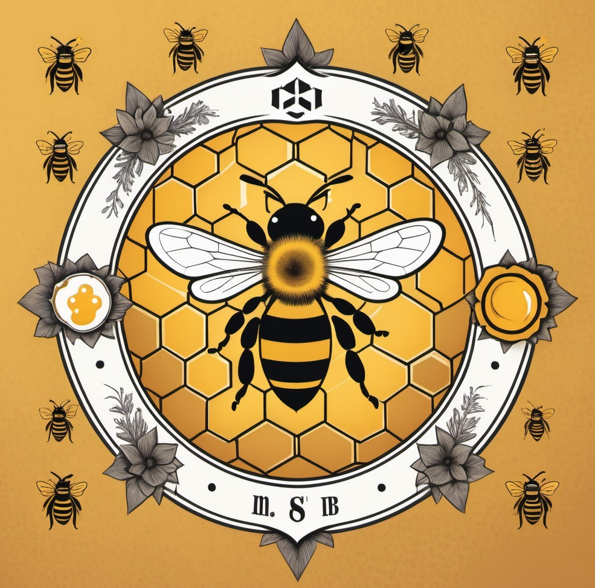

# Simbolo città
Informazione città di [fitir](fitir.md)
- Simbolo: **ape**
- **Colori** della città: larice d'autunno (così Valeruz è contento), nero e bianco
- **Stemma** di partenza (fig. sotto)

