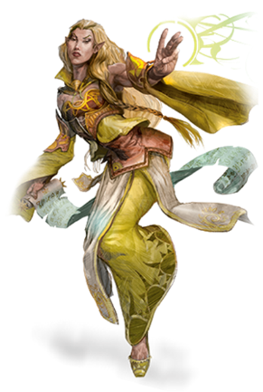
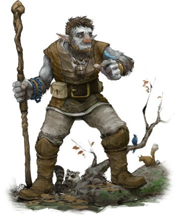
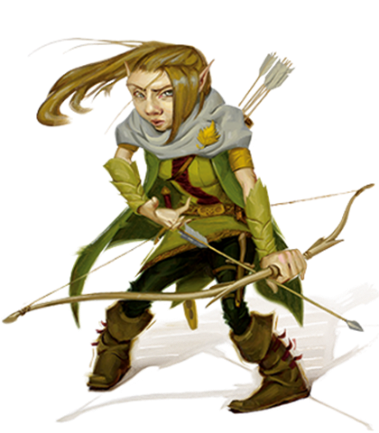
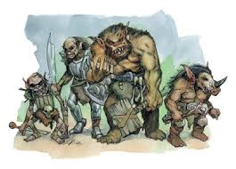
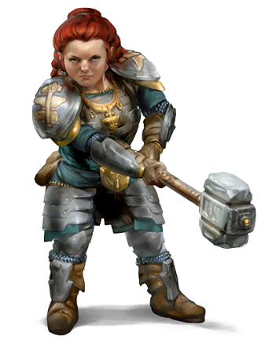
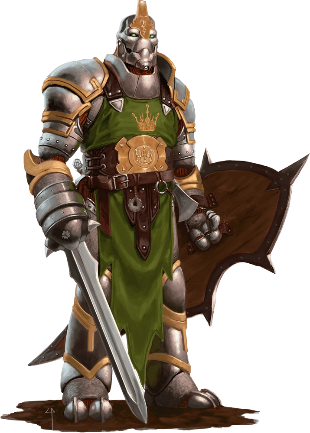

# Razze

Alcuni frammenti di lore sulle razze presenti nel continente.

 

## Elfi

I primi Elfi nacquero nel Feywild, o Primo Mondo, creati ad immagine e somiglianza della Regina e del Re della Corte d’Estate, le Arcifey Titania e Oberon. Questi elfi vennero chiamati Eladrin dai loro creatori. Gli elfi si diffusero presto anche nel Piano Materiale: ovunque cresca una foresta, le selve stesse sembrano partorire gruppi di umanoidi con le orecchie a punta e gli occhi chiari. Tuttavia, nel loro passaggio dal Primo Mondo al Piano Materiale, gli elfi perdono l’immortalità tipica della loro razza, nonché alcune delle loro caratteristiche più animalesche. 

E’ raro trovare una razza che sia indifferente a quella elfica. Odiati dai Nani, che li incolpano erroneamente di aver portato sul Piano Materiale la piaga dei Goblinoid; temuti e desiderati dagli Umani, irresistibilmente attratti dalla loro serena personalità e dal loro aspetto eternamente giovane (e il sentimento è spesso reciproco, dato che gli elfi invidiano la vitalità e la resilienza della razza umana); riveriti da ogni altra razza per la loro aspettativa vitale, che ammonta a generazioni e generazioni di quella delle altre razze.

## Firbolg

Purtroppo, è raro trovare una comunità di Firbolg nel Piano Materiale. La pelle grigia e le fattezze bestiali di questi giganti gentili hanno portato a diversi attacchi nei loro confronti dalle altre razze del continente, motivati da odio e paura.  

Nel Primo Mondo, tuttavia, i Firbolg prosperano sotto la guida della Saggia Fialla, superstite della Prima Invasione Goblinoid nella Foresta dell’Inizio. Dopo il sacrificio dell’Ordine dei Romenoriani durante la Prima Invasione, il popolo ha accettato la filosofia pacifista promossa dall’Arcidruida, e sebbene questo li renda talvolta oggetto delle angherie delle altre razze del Feywild, la loro mitezza e reputazione fanno sì che un viandante Firbolg sia sempre ben accolto nel Primo Mondo, ovunque egli o ella si avventuri.

## Gnomi

Uno Gnomo può restare in vita indefinitamente, a patto che trovi qualcosa per occupare la sua mente e le sue mani: una nuova esperienza, che permetta allo Gnomo di perdersi completamente in un aspetto della vita che prima di allora non aveva mai considerato. Gli gnomi hanno una predisposizione a provare nuove esperienze e ogni gnomo diventa autosufficiente ben prima di raggiungere la maturità, ma quasi nessuno di loro è in grado di raggiungere un livello di maestria, dato che una mancanza di tangibili progressi in un’attività alla lunga li porta ad abbandonarla, per timore di iniziare il processo di Sbiadimento.  

Uno gnomo che non è in grado di trovare qualcosa che non lo annoi subisce un processo chiamato lo Sbiadimento. La sua carnagione, di norma accesa, impallidisce e ingrigisce, così come i suoi capelli. Il processo è irreversibile dopo due settimane e fatale in un mese. Per questo, anche i centri di detenzione gnomici per criminali prevedono dei modi per evitare lo Sbiadimento nei detenuti, e questa politica di rieducazione si applica anche ai membri delle altre razze.

## Goblinoid

Nati nella Corte d’Inverno dagli incubi e dalle paure degli Eladrin, Bugbear, Goblin e Hobgoblin hanno avuto un’esistenza difficile fin dal loro concepimento. Ognuna delle tre sottorazze è irresistibilmente attratta dal fuoco e dal calore: i Bugbear nascono dalle fantasie dei bambini Eladrin, che credevano esistesse un mostro sotto il letto, e la loro ragione per esistere risiede esclusivamente nel rapire la progenie delle altre razze e trascinarla nel buio per divorarla; i Goblin incarnano la primordiale bramosia delle altre razze per il fuoco e per la luce, e sono ossessionati da ogni genere di fiamma, appiccando fuoco a qualsiasi cosa incontrino per stabilire se sia ignifuga o mano; gli Hobgoblin nascono invece come riflesso degli Elfi, tanto legali e malvagi quanto caotici e benigni sono i secondi, e la loro brama del fuoco è dovuta al fatto di dover forgiare armi sempre migliori, per poter un giorno sconfiggere in battaglia i figli di Oberon e Titania.  

I Goblinoid sembravano essere condannati ad un’eternità infernale: nelle terre della Corte d’Inverno è sempre notte, e ogni fiamma viene velocemente soffocata dai venti gelidi che imperversano sulle lande.  

Tuttavia, quando l’Alleanza delle Quattro Razze chiese l’aiuto delle due Corti contro gli umani di Bastion, Baba Yaga inviò le sue stregonerie e la sua armata di incubi a sostegno della Foresta. Tra i sottoposti della Strega c’erano anche alcuni Goblinoid, che riuscirono a sfuggire al controllo della loro padrona e Dea durante il Tumulto, proliferando sotto il sole del piano materiale come mai erano riusciti nella Corte d’Inverno.  

Se Bugbear e Goblin erano soddisfatti di trascorrere le loro giornate a indulgere nei loro desideri più basici, gli Hobgoblin volsero presto lo sguardo verso le forge dei Nani, sulla catena montuosa del Felsenarmung. Grazie ad un’alleanza con i pallidi nani del sottosuolo, i Duergar, i Goblinoid furono in grado di sferrare un attacco a sorpresa ad una delle tre sacre Forge di Moradin, sul monte Wolfzann, conquistandola e riuscendo a mantenerla sotto il loro controllo nonostante i furiosi attacchi dei clan delle colline e delle montagne. È da questa roccaforte sullo Wolfzann che i Goblinoid hanno ripetutamente tentato di invadere la Foresta dell’Inizio, con l’unico obiettivo di compiere un genocidio della razza Eladrin.

## Nani

Non esiste razza più legata alla terra e alla roccia. Fino alla Notte del Tumulto, la civiltà Nanica dominava incontrastata i picchi del Felsenurmarmung, grazie alle tre forge affidate loro dal creatore della loro razza, il Dio Moradin. Le tre forge contengono ciascuna un’Incudine Divina, dove i mastri fabbri seguaci di Moradin possono forgiare armi, scudi e armature paragonabili a quelli branditi dai Celestiali nelle loro battaglie contro Demoni e Diavoli. Wolfzann era la forgia delle armi, Feuerzunge quella degli scudi e Schneeflocke quella delle armature.  

Tuttavia, per alcuni nani, la terra e le rocce diventarono un’ossessione. La ricerca di metalli e minerali, normalmente subordinata al miglioramento della vita del popolo nanico, diventava il fine ultimo della loro esistenza. Questi Nani vennero presto corrotti dalle forze all’opera nel Mondo Sotterraneo. La loro pelle si tinse di viola, i loro capelli e i loro occhi divennero candidi, e si separarono completamente dai Nani di Superficie, prendendo il nome di Duergar.  

I Duergar volevano che uno dei tre picchi sacri a Moradin fosse loro concesso, perché potessero forgiare artefatti al riparo dagli sguardi indiscreti degli altri Clan. I Clan di superficie, forti del sostegno di Moradin, si rifiutarono categoricamente di abbandonare il controllo di una delle tre Forge.  

Dopo che Wolfzann venne loro sottratta nella Notte del Tradimento, i Nani superstiti del clan Wolfzann si stabilirono nelle Colline di Grasumarmung, da cui mai sono riusciti a riconquistare le vette del picco. L’alleanza di Duergar e Goblinoid controlla ancora Wolfzann, ma nessuna delle forge è più stata in grado di forgiare artefatti divini, come se Moradin avesse tolto il suo favore al suo popolo prediletto. Tuttavia, Goblinoid e Duergar sfoggiano spesso in battaglia armi incantate con la magia del Primo Mondo o dell’Abisso.

## Warforged

Nati nelle fucine dei Nani di Schneeflocke, i Costrutti chiamati Forgiati esistevano essenzialmente per svolgere una funzione a beneficio delle altre razze. Il loro libero arbitrio era inesistente, la loro intelligenza limitata alle loro mansioni e il pensiero di fare qualcosa che andasse contro i desideri del loro creatore considerato Eresia.  

Tuttavia, ogni macchina ha un ciclo vitale. E i Nani iniziarono a notare che, quando era tempo di rottamare i Forgiati, alcuni non si recavano alla Discarica di loro spontanea volontà, e dovevano esservi trascinati. Non avendo trovato difetti di progettazione, i Nani si rivolsero all'Accademia Larif Bale, inviando un prototipo recalcitrante perché venisse analizzato. Una scelta logica, dato che l’Accademia riuniva alcune delle menti più brillanti di tutto il continente, ma che avrebbe irrimediabilmente alterato il corso della storia dei Forgiati.  

I Nani credevano che il processo per Forgiare fosse impossibile da riprodurre nel tempo concesso all'Accademia per analizzare il Costrutto. Avevano sottovalutato la scienza Arcana. Incantesimi di Creazione per i materiali, Scrying per spiare i nani all’opera, Borrowed Knowledge e Detect Thoughts per rubare loro le conoscenze. Prima che fossero passati due semestri, il primo Forgiato venne costruito. Tuttavia, questi Costrutti non sarebbero stati utilizzati per scopi pacifici. L’Accademia era in quegli anni in aperta tensione con le altre potenze della Pianura Avonia, che le contestavano la sua indipendenza. Cinque anni dopo, dopo aver costruito un esercito di 1024 Warforged, i maghi decisero che avrebbero dato una dimostrazione della loro forza, muovendo in battaglia contro l’esercito di Staret. 

Fu un massacro.  

I Maghi avevano sottovalutato l’efficienza delle loro creazioni. Potevano comandarle utilizzando potere magico, ma si resero conto di non avere l’energia necessaria per farlo. Anche dopo che l’esercito di Staret andò in rotta, i Warforged continuarono ad avanzare, imperterriti, uccidendo ogni cosa si muovesse, dato che quello era il loro Comando Assoluto. Fino ai Cancelli della Città, dentro a cui erano rifugiati i contadini delle campagne circostanti.  

Fu allora, quando il sole era allo Zenit del secondo giorno del mese Messidoro, quando il suo potere era massimo, che il giovane Prescelto di Lathander diede la sua vita per un’Intervento del suo Dio. E ovunque si trovassero, i Forgiati per la Guerra guadagnarono in quel momento il libero arbitrio.
