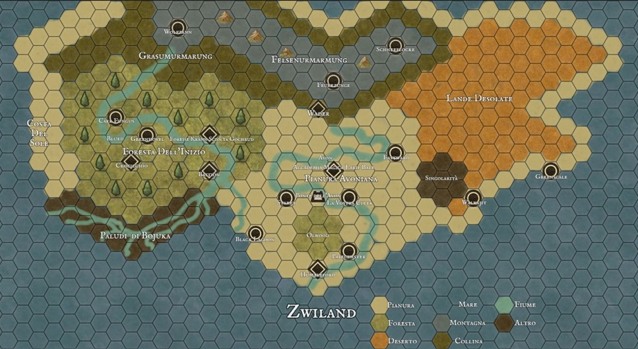

# Mappa

## La regione di Olspot
L’avventura si svolgerà completamente entro la regione di Olspot. Delimitata a nord dalle montagne della Felsenarmarung e circondata da ogni altra parte dal Mare dello Zwiland, la regione, sebbene di dimensioni limitate, contiene diversi ambienti naturali, razze e credi. È una regione densa di conflitti, dove le città stato sono in continua competizione, ma che muove i suoi primi passi verso la pace.

## I luoghi del continente
* [foresta-inizio](places/foresta-inizio.md)
* [pianura-avonia](places/pianura-avonia.md)
* [terre-desolate](places/terre-desolate.md)
* [felsenarmarung](places/felsenarmarung.md)
* [grasumarmarung](places/grasumarmarung.md)
