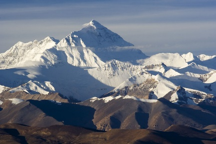

# Felsenarmarung

Un tempo dominio incontrastato di Draghi e Nani, dopo che i primi sono stati massacrati o schiavizzati durante la Guerra Post-Baliana e i secondi hanno perso una delle loro città durante la Notte del Tradimento, le montagne sono abitate da molte razze diverse. Tuttavia, il numero di città è molto ridotto rispetto alla Pianura Avonia.

### Feuerzunge

**Insediamento  
Località** Montagne della Felsenarmarung  
**Dimensione** Grande Villaggio (3500)  
**Razze** Nani di Montagna (Prevalenza); Varie  
**Religioni** Moradin  
**Commercio**  
**Import** Prodotti Agricoli (Grasumarmarung)  
**Export** Scudi  
**Tipo di governo** Monarchia (Capoclan Kerrig Embershield)

Una città costruita su massicci di granito, che i Nani della Montagna condividono con le altre razze di Olspot, nonché con un grande numero di capre che i nani hanno imparato ad addestrare come cavalcature (o meglio, capralcature). Sotto la guida del Re Della Montagna, Kerrig Embershield, e sotto l’egida dello Scudo che dà il nome al suo clan, Feuerzunge ha fondato l’Alleanza dei Lord, un’organizzazione che riunisce rappresentanti delle maggiori città del Continente, dalle Lande Desolate alla Foresta dell’Inizio, passando per la Pianura Avonia. L’Alleanza, sebbene criticata dai suoi detrattori per la sua scarsa proattività, ha il merito di aver creato l’Esercito dei Lord, una forza armata composta da soldati provenienti da ogni Città membra.

### Schneelocke

**Insediamento  
Località** Montagne della Felsenarmarung  
**Dimensione** Grande Villaggio (3500)  
**Razze** Nani di Montagna  
**Religioni** Moradin  
**Commercio**  
**Import** Prodotti Agricoli (Grasumarmarung)  
**Export** Costrutti; Armature  
**Tipo di governo** Governata dalla Gilda degli Armaioli e degli Artificieri

Dopo aver perso Wolfszann a causa degli Hobgoblin, i nani di Schneelocke hanno deciso di isolarsi dal resto del continente, mantenendo sporadici contatti esclusivamente con altri Nani delle Montagne. Grazie alla ricchezza delle loro miniere e alla conoscenza di rocce e metalli, i Nani di Schneelocke hanno iniziato a creare Costrutti non animati dalla magia arcana. Grazie alla loro instancabile forza lavoro, Schneelocke prospera. In questa città si tengono le riunioni dell’Alleanza dei Lord, nonostante alcuni Nani della città trovino la presenza sul territorio di Schneelocke di un’Alleanza composta principalmente da non-nani inaccettabile. Il governo cittadino è affidato alla Gilda degli Armaioli e degli Artificieri.

### Wolfszann, la Città Perduta

**Insediamento  
Località** Montagne della Felsenarmarung  
**Dimensione** Ignota  
**Razze** Goblinoid, Duergar  
**Religioni** Baba Yaga, Laduguer  
**Commercio**  
**Export** Armi  
**Tipo di governo** Ignota

Poco è noto al resto del continente sui piani di Hobgoblin e Duergar, ma le continue incursioni verso la Foresta dell’Inizio non fanno presagire alcunchè di buono.