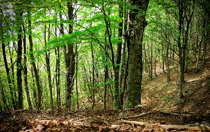

# Foresta Inizio

Una foresta delimitata a nord dalla catena montuosa del Felsenurmarmung e a sud dalla un’ampia zona paludosa e acquitrinosa, la torba di Bojuka, dove il fiume Blued, che attraversa la Foresta, sfocia a delta nello Zwiland. Ad est rispetto alla foresta c’è la Pianura Avonia, mentre ad Ovest il terreno si fa via via più pianeggiante, fino ad arrivare alla Costa del Sole.

## L'incipit della civiltà
Teologi e uomini di scienza si trovano concordi nell'affermare che la Foresta dell’Inizio e il continente di Olspot siano i primi luoghi creati dal Divino Miglietta, il Padre di tutti gli Dei.  A riprova di questa teoria, chiunque visiti il villaggio di **Greenhovel**, nel cuore della foresta, può trovarvi il **Santuario della Concordia**.

In questo luogo sacro, ogni singola divinità con dei seguaci sul Piano Materiale è rappresentata in uno spazio di preghiera. Il Santuario è suddiviso in nove sezioni, una per ognuno degli Allineamenti, codici di comportamento a cui ognuna delle Divinità fa riferimento. Questo luogo sacro viene protetto dall’alba dei tempi dalla Sacerdotessa, un essere celestiale vincolato alle sue mura. Recentemente, lo spirito di una mezzelfa di nome Lena è stato visto spesso al fianco della Sacerdotessa, come sua protettrice e collaboratrice.

## Portale per il feywind
Il Feywild, o Primo Mondo, è un Piano di esistenza parallelo a quello materiale- uno specchio distorto, che per le leggi del cosmo non dovrebbe mai interagire con la versione di Olspot creata dagli Dei. Tuttavia, quando l’Alleanza delle Selve chiese l’aiuto della Foresta dell’Inizio durante la guerra contro l’insediamento umano di **Bastion**, Titania, la Regina della Corte d’Estate, e Baba Yaga, Maliarda della Corte d’Inverno, concessero la loro magia alla causa, a patto che l’Alleanza costruisse loro un Portale Planare sul Piano Materiale.

Il portale per il Feywild, chiamato il **Crocicchio**, si trova all’incrocio tra quattro alberi, ognuno rappresentativo di una delle quattro stagioni: un pesco in fiore, un melo carico di frutti, un acero dalle foglie color dell’incendio e un abete innevato.

Dopo la Notte del Tumulto, in cui Bastion venne rasa al suolo e la sua popolazione decimata, Gufidi, Centauri e Fate, tre delle quattro Razze che componevano l’Alleanza, fuggirono dal Piano Materiale attraverso il Portale, temendo l’ira degli umani. Solo i Firbolg, la più gentile delle quattro, restò per aiutare gli incolpevoli cittadini di Bastion a fondare l’insediamento di Greenhovel.

Per ricucire lo strappo creatosi tra il Piano Materiale e il Primo Mondo in seguito al Tumulto, Titania e i Druidi dell’Alleanza fondarono l’Enclave di Smeraldo, un’associazione di Barbari, Druidi e Ranger che ha il compito di aiutare la coesistenza tra civiltà e ambiente. Con il tempo, rappresentanti dell’Enclave si diffusero per l’intero continente di Wildemount.

## Greenhovel

Un insediamento finanziato dalle donazioni dei pellegrini al Santuario.  
**Popolazione:** intorno ai 650 abitanti (Villaggio)  
**Forma di Governo:** Monarchia (Attuale capo del villaggio: Skarn il Monco (mezzorco))  
**Races** Halfling, Umani (abitanti stanziali); Varie (pellegrini)  
**Religioni** Varie  
**Import** Grano  
**Export** Pellicce, suppellettili in argilla

## Caer Fungus

Un insediamento di gnomi a nord-ovest rispetto a Greenhovel  
**Popolazione:** intorno ai 1450 abitanti (Piccola Città)  
**Forma di Governo:** Monarchia (Attuale capo del villaggio: Aviaris Lonnek (Gnomo))  
**Races** Gnomi, Varie (quartiere Pioppino)  
**Religioni** Garl Glittergold  
**Import** Import di lusso  
**Export** Artigianato

Le case di Caer Fungus sono state costruite sullo stile di funghi. Gli abitanti del villaggio vivono normalmente negli ombrelli di questi edifici, mentre agli estranei vengono affittate le stanze del gambo.

Caer Fungus è suddivisa in tre quartieri: il Pioppino, l’Orecchione e il Chiodino. L’appartenenza ad uno dei tre quartieri dipende dal colore degli gnomi: gli gnomi dal colorito più roseo sono pieni d’inventiva e capacità d’innovare, e gli viene garantito un posto nel Chiodino, dove possono conversare con altri gnomi altamente motivati.

Viceversa, agli gnomi che hanno esaurito la loro vena creativa e la cui pelle è sbiadita viene riservato un posto nel Pioppino, un Complesso abitato da membri di molte razze, dove il crogiolo culturale gli permette di riaccendere la scintilla della creatività.

## Collina di Bastion

Sotto questa collina giacciono le rovine del primo insediamento umano nella Foresta dell’Inizio. Fondato dal giovane cacciatore William Scarlett e dalla consorte, l’elfa Gilnala Forestshade, dopo che i due erano stati esiliati dalle rispettive comunità per il loro amore, al tempo considerato alla stregua della bestialità da entrambe le razze. Bastion divenne un rifugio per coloro che erano stati esiliati dal vicino Regno Cremisi. Grazie alla guida della famiglia Scarlett, alle politiche isolazioniste del Regno Cremisi e al rapporto di amicizia con le quattro razze dell’Alleanza, Bastion crebbe da un insediamento ai confini della foresta a un piccolo regno, esportatore in tutto il mondo del legno pregiato e magico della Foresta, di cui Bastion aveva il monopolio.  

Il deterioramento del rapporto con l’Alleanza fu la causa della rovina di Bastion, durante il regno del nipote di William Scarlett, il mezzelfo Robin. Le richieste di legno per armi del vicino Regno Cremisi, con cui Bastion aveva sviluppato un rapporto commerciale, si fecero più pressanti, e ai taglialegna di Bastion venne comandato di abbattere alberi non compresi nell'accordo con l’Alleanza. Le aspre proteste dei rappresentanti dell’Alleanza vennero soffocate nel sangue dai mercenari assoldati da Robin. L’Alleanza si rivolse alle forze del Primo Mondo, e il loro intervento durante la Notte del Tumulto seppellì Bastion in una frana di terra, rocce e radici.  

Le rovine esterne di Bastion sono state spogliate della maggior parte dei loro tesori. Tuttavia, l’antica Sala del Trono non è ancora stata portata alla luce, e i gruppi di avventurieri che si addentrano nelle profondità della Collina di Bastion non fanno ritorno. Qualcosa si nasconde là sotto, ma l’Enclave di Smeraldo non ha intenzione di inviare i suoi rappresentanti finché il rischio per la Foresta dell’Inizio o per Greenhovel non sarà comprovato.

## Rovine di Foreise Krann Sciolta Gochrud

Qui sorgeva un tempo un insediamento Firbolg. Attaccato durante la Prima Invastion Goblinoid, i pacifici giganti della foresta sono fuggiti nel Primo Mondo, da cui hanno contrattaccato a fianco dell’Enclave di Smeraldo. Dopo la fine delle ostilità, il druido a capo della comunità, la saggia Fialla, ha convinto il suo popolo a rimanere nel Primo Mondo.  

Il villaggio è protetto da un’armatura animata alta sette piedi, che attacca chiunque si avvicini. Lo spirito che la anima è quello di Romenor Wildream, caduto in battaglia durante la Seconda Invasione Goblinoid per mano dell’Hobgoblin Zalzag il Mulo.

## Albero Storto

Un tempo la casa di Tanya, una Green Hag, prima che un gruppo di avventurieri la sconfiggesse. Le piante e gli animali intorno all'Albero Storto hanno sviluppato abilità magiche, avendo assorbito l’essenza magica di un Incantatore caduto in battaglia contro la Strega.

## Tomba di un Eroe Gnomico

All'ombra di questo albero, sotto uno strato di funghi commestibili, riposa un membro gnomico dell’Enclave di Smeraldo, che ha trovato la morte per mano di Zalzag il Mulo.