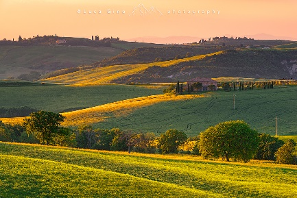

# Grasumarmarung

Verdi colline a sud della Grasumarmarung, dove vivono comunità di Nani delle Colline, Halfling e Umani, divisi in una miriade di villaggi autosufficienti

### Kater

**Insediamento  
Località** Montagne della Grasumarmarung  
**Dimensione** Villaggio (650)  
**Razze** Nani delle Colline  
**Religioni** Spiriti della Natura  
**Commercio**  
**Export** Vino, Prodotti Agricoli  
**Tipo di governo** Guidato dalla rappresentante dell’Enclave di Smeraldo Brallera Woodmaul

Insediamento Nanico noto per la produzione di vino pregiato. Sotto la guida della Druida Brallera Woodmaul, questo insediamento dalle terre magicamente fertili sta avviando le pratiche per entrare nell'Alleanza dei Lord.
