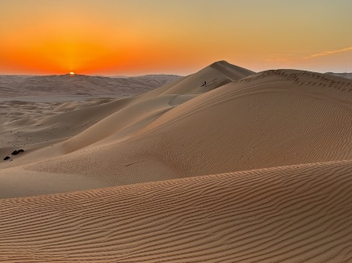

# Terre desolate

Terre in preda all'anarchia, misteriose e abitate prevalentemente da razze che gli umani ritengono mostruose, come Orchi, Kobold e Gnoll. Gli umani hanno provato in più di un’occasione ad esplorare le terre ad est della Pianura Avoniana, ma il deserto li ha sconfitti ogni volta. La città di Eastward è stata fondata già in epoca pre-Baliana per fungere da bastione difensivo contro potenziali orde di invasori dell’Est.

## Greenscale

**Insediamento  
Località** Coste delle Lande Desolate  
**Dimensione** Piccola Città (8500)  
**Razze** Dragonborn  
**Religioni** Bahamut, Tiamat (principali); Sardior (draghi di gemma)  
**Commercio**  
**Import** Cera, legno pregiato, gemme preziose  
**Export** Pergamene di incantesimi, Pozioni  
**Tipo di governo** Magocrazia  
Insediamento fondato dai discendenti del drago Antico Buchemballor, abitato prevalentemente da Draghi di Smeraldo. Qui è stata recentemente fondata una seconda Accademia Magica, frequentabile esclusivamente da Dragonborn. Il loro rappresentante dell’Alleanza dei Lord è il Dragonborn Premtaxul Greengem

## Walkajit

**Insediamento  
Località** Coste delle Lande Desolate  
**Dimensione** Piccola Città (8500)  
**Razze** Genasi (Prevalente), Varie  
**Religioni** Varie  
**Commercio**  
**Nodo commerciale fondamentale** per il mercato degli schiavi  
**Tipo di governo** Rappresentanti della Gilda dei Mercanti governano la città

La principale città portuale ai confini del Deserto delle Ossa, abitata prevalentemente da Genasi, sede del principale mercato di schiavi del continente. Il Capo della Gilda dei Mercanti, Scorch Tagiyutan, è il volto pubblico di Walkajit, ma è un segreto di Pulcinella che la Rete Nera sia vicina al vertice della piramide del comando.

## Deserto delle Ossa

La zona più inospitale delle Lande Desolate. Di recente, un incantesimo di Scrying da parte di un mago Genasi di Walkajit ha rivelato un’ampia nuvola di oscurità perenne in lenta espansione, di probabile origine divina, in una zona normalmente occupata da Coboldi e Gnoll. Si dice che l’oscurità sia dimora di demoni e angeli caduti di ogni genere, anche se come siano arrivati sul piano Materiale è un mistero a cui nessuno ha ancora trovato una risposta.